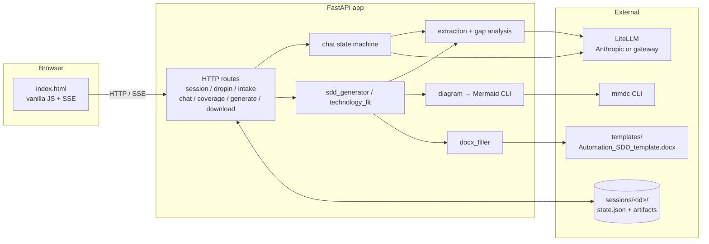

# Automation SDD Builder

Turn fuzzy business descriptions of a process into developer-ready specs. Drop in a meeting transcript or have a guided chat, and the app produces either a **Technology Fit Report** (should we automate this, and how?) or a fully filled **Software Design Document** matching your Word template — with an embedded applications diagram and a separate `gaps.md` of focused follow-up questions for the business.

Built for the in-between work an automation analyst does every day: translating business hand-waving into something a Blue Prism / Power Automate / SAP BTP developer can actually build from.

## What you get

See [`examples/sample_output/`](examples/sample_output/) for real, unedited runs:
- **SDD mode**, drop-in input → [`sdd_invoice_processing/`](examples/sample_output/sdd_invoice_processing/): a `.docx` filled from your template, a PNG applications diagram, the Mermaid source, and a `gaps.md` listing every step-level detail the tool wasn't confident about.
- **Technology Fit mode**, vague three-line email → [`technology_fit_vague_request/`](examples/sample_output/technology_fit_vague_request/): a markdown recommendation that, in this case, refuses to commit and tells you what conversation has to happen first.

## Features

- **Two output modes:** Technology Fit recommendation (markdown) or full SDD (`.docx` matching your template).
- **Two input styles:** drop in a transcript / email / paste / file upload, or run a guided chat that asks one focused question at a time.
- **Gap analysis pass** — every generation pre-scores the input against a developer-readiness rubric and produces a `gaps.md` of targeted questions the business can actually answer (no platform jargon).
- **Applications diagram** — generated as Mermaid, rendered to PNG with the Mermaid CLI, embedded inline in the SDD. `.mmd` source ships alongside for later editing.
- **Bring your own template** — the `.docx` template is the source of truth. Tokenize once in Word and the filler clones rows for applications / errors / reports, embeds the diagram, and renders the step-by-step flow.
- **Provider-agnostic LLM access** via [LiteLLM](https://docs.litellm.ai). Anthropic API today; any OpenAI-compatible corporate gateway later by editing `.env` — no code changes.

## Architecture



The orchestration is a hand-written state machine — no agent framework. Where LLM judgment is needed (chat clarifier, "is the user done" detection, narrative generation, gap analysis), it's a single-purpose call with a strict Pydantic-parsed return.

## Quickstart

**Prerequisites:** Python 3.11+, Node 18+, [`uv`](https://docs.astral.sh/uv/), and `@mermaid-js/mermaid-cli` (`npm install -g @mermaid-js/mermaid-cli`). An Anthropic API key from [console.anthropic.com](https://console.anthropic.com) — note this is **separate from a Claude.ai subscription**.

```powershell
# Clone, then from the repo root:
uv venv
.venv\Scripts\activate            # macOS/Linux: source .venv/bin/activate
uv pip install -e ".[dev]"

# Configure LLM access:
Copy-Item .env.example .env       # macOS/Linux: cp .env.example .env
# Edit .env and set ANTHROPIC_API_KEY.

# Run:
uvicorn app.main:app --reload
# Visit http://127.0.0.1:8000/
```

If you have `make`, the equivalents are `make install`, `make run`. Other targets: `make test`, `make test-live`, `make format`, `make lint`, `make check`.

## Bringing your own SDD template

`templates/Automation_SDD_template.docx` is the docx the generator fills. It's already tokenized to match the included sample. To use your own template instead:

1. Save your starting docx somewhere outside `templates/` (e.g. the repo root).
2. Run `python scripts/prepare_template.py` to print the list of `{{tokens}}` and where each one belongs. (This script prints guidance — it doesn't modify your docx.)
3. In Word, paste each token into the matching cell. For the Applications, Errors, and Reports tables, keep one template data row with the `{{prefix.field}}` tokens; delete any extra empty rows (the filler clones the template row once per item).
4. Add a paragraph containing `{{applications_diagram}}` where the diagram should go, and a paragraph containing `{{steps}}` where the step-by-step flow should go.
5. Save the tokenized result to `templates/Automation_SDD_template.docx`.

Token names and locations are documented in [`prompts/template_tokens.md`](prompts/template_tokens.md).

## Using a different LLM backend

The app talks to models through [LiteLLM](https://docs.litellm.ai), so any provider LiteLLM supports works — Anthropic direct, Azure, Bedrock, Ollama, or any OpenAI-compatible corporate gateway. Switch by editing `.env` only.

To route through an internal gateway:

```
OPENAI_API_BASE=https://gateway.yourcompany.internal/v1
OPENAI_API_KEY=<gateway-token>
MODEL_MAIN=openai/internal-claude-sonnet
MODEL_CHEAP=openai/internal-claude-haiku
```

The model string's prefix (`anthropic/`, `openai/`, `bedrock/`, …) tells LiteLLM how to route. App code only references the semantic roles `MODEL_MAIN` (used for extraction, narrative, clarifier questions) and `MODEL_CHEAP` (used for the "is the user done" classifier).

## Project structure

```
app/                 FastAPI app + orchestration modules
  main.py            HTTP routes
  chat.py            chat state machine + handle_turn streaming
  extraction.py      raw text → Extracted (Pydantic)
  gap_analysis.py    Extracted → Coverage (rubric-scored, with questions)
  sdd_generator.py   end-to-end SDD pipeline
  technology_fit.py  Tech Fit markdown report generator
  diagram.py         Mermaid generation + mmdc render
  docx_filler.py     template token replacement + repeating rows + diagram embed
  llm.py             LiteLLM wrapper: complete / complete_json / stream
  models.py          Pydantic schemas for Session, Extracted, Coverage, Intake, etc.
  session.py         JSON-on-disk session store
  prompts.py         prompt file loader
prompts/             All LLM prompts as .md files — iterate without touching code
templates/           Word template + Jinja templates for the UI
static/              CSS + vanilla JS for the single-page UI
evals/               pytest live tests + fixtures
scripts/             one-off CLI helpers (env check, smoke tests, template guide)
examples/            sample outputs visitors can browse without running the app
sessions/            generated at runtime; one folder per session, JSON state + artifacts
```

## Design decisions

- **No agent framework.** Orchestration is a deterministic state machine. LLM calls are isolated, single-purpose, and parsed into Pydantic models with a validation-retry loop. Easier to debug than autonomous loops, and the failure modes are obvious.
- **JSON files on disk for sessions, not a database.** The operator can `cat` `sessions/<id>/state.json` to see exactly what the model knows. No migrations, no ORM, no Docker compose. Costs nothing to ship.
- **Prompts live as `.md` files under `prompts/`.** The highest-leverage iteration in this project is prompt editing. Keeping them out of Python means changing tone, instructions, or schema doesn't require a code review.
- **Vanilla JS, no React, no build step.** One language (Python) for the backend, a single static HTML/CSS/JS bundle for the frontend, SSE for streaming. Deployable as one container later with no rework.
- **Two-model strategy.** A capable model (`MODEL_MAIN`) does extraction, narrative, and clarifier selection; a cheap model (`MODEL_CHEAP`) handles the one repetitive classifier ("is the user done describing the process?"). Configurable per environment.

## Roadmap (not in v1)

- Web deployment + corporate SSO (Azure AD / Okta)
- Multi-user sessions and sharable session links for business users
- Approval workflow (draft → review → approved)
- Real DB instead of JSON files
- Audio/video transcription input
- Refinement of generated docx via additional chat ("change step 3 to…")
- Better evals + a small benchmark suite
- Platform-specific output adapters (Blue Prism object skeletons, Power Automate flow JSON)

See [`spec.md`](spec.md) for the full design and [`tasks.md`](tasks.md) for the ticket plan that produced v1.

## Built with

[FastAPI](https://fastapi.tiangolo.com/) · [LiteLLM](https://docs.litellm.ai) · [Pydantic](https://docs.pydantic.dev) · [python-docx](https://python-docx.readthedocs.io) · [Mermaid CLI](https://github.com/mermaid-js/mermaid-cli) · [HTMX](https://htmx.org/) (loaded but kept minimal — the UI is mostly plain JS + SSE).
