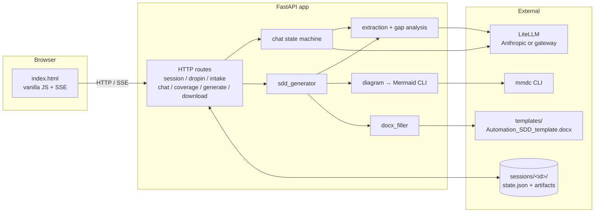

# Automation SDD Builder

Turn business descriptions of a process into a developer-ready spec.

Built for the in-between work an automation analyst does every day: translating business hand-waving into something a developer can actually build from.

## Features

- **Two input styles:** drop in a transcript / email / paste / file upload, or run a guided chat that asks one focused question at a time.
- **One output:** a `.docx` filled from your template, with the Mermaid applications diagram rendered and embedded inline.
- **Coverage-driven chat** — every chat turn scores the conversation-so-far against a developer-readiness rubric, drives the next clarifier question, and unlocks the Generate button once the coverage threshold is met.
- **Smart re-extraction** — acknowledgment-only turns ("ok", "yes") skip the expensive extraction pass via a cheap Haiku classifier, so a long chat stays affordable.
- **Bring your own template** — the `.docx` template is the source of truth. Tokenize once in Word and the filler clones rows for applications / errors / reports, embeds the diagram, and renders the step-by-step flow.
- **Provider-agnostic LLM access** via [LiteLLM](https://docs.litellm.ai). Anthropic API today (with prompt caching enabled for ~90% off the repeated system prompt); any OpenAI-compatible corporate gateway later by editing `.env` — no code changes.

## Architecture



The orchestration is a hand-written state machine: *no agent framework*.
## Quickstart

**Prerequisites:** Python 3.11+, Node 18+, [`uv`](https://docs.astral.sh/uv/), and `@mermaid-js/mermaid-cli` (`npm install -g @mermaid-js/mermaid-cli`). An LLM API key.

```powershell
# Clone, then from the repo root:
uv venv
.venv\Scripts\activate            # macOS/Linux: source .venv/bin/activate
uv pip install -e ".[dev]"

# Configure LLM access:
Copy-Item .env.example .env       # macOS/Linux: cp .env.example .env
# Edit .env and set ANTHROPIC_API_KEY.

# Run:
uvicorn app.main:app --reload
# Visit http://127.0.0.1:8000/
```

If you have `make`, the equivalents are `make install`, `make run`. Other targets: `make format`, `make lint`, `make check`.

## Bringing your own SDD template

`templates/Automation_SDD_template.docx` is the docx the generator fills. It's already tokenized to match the included sample. To use your own template instead:

1. Save your starting docx somewhere outside `templates/` (e.g. the repo root).
2. Open [`prompts/template_tokens.md`](prompts/template_tokens.md) for the full list of `{{tokens}}` and where each one belongs.
3. In Word, paste each token into the matching cell. For the Applications, Errors, and Reports tables, keep one template data row with the `{{prefix.field}}` tokens; delete any extra empty rows (the filler clones the template row once per item).
4. Add a paragraph containing `{{applications_diagram}}` where the diagram should go, and a paragraph containing `{{steps}}` where the step-by-step flow should go.
5. Save the tokenized result to `templates/Automation_SDD_template.docx` (or point `TEMPLATE_PATH` in `.env` somewhere else).

## Using a different LLM backend

The app talks to models through [LiteLLM](https://docs.litellm.ai), so any provider LiteLLM supports works — Anthropic direct, Azure, Bedrock, Ollama, or any OpenAI-compatible corporate gateway. Switch by editing `.env` only.

To route through an internal gateway:

```
OPENAI_API_BASE=
OPENAI_API_KEY=<gateway-token>
MODEL_MAIN=openai/internal-claude-sonnet
MODEL_CHEAP=openai/internal-claude-haiku
```

The model string's prefix (`anthropic/`, `openai/`, `bedrock/`, …) tells LiteLLM how to route. App code only references the semantic roles `MODEL_MAIN` (used for extraction, narrative, clarifier questions) and `MODEL_CHEAP` (used for the "is the user done" classifier).

## Project structure

```
app/                 FastAPI app + orchestration modules
  main.py            HTTP routes
  chat.py            chat state machine + handle_turn streaming
  extraction.py      raw text → Extracted (Pydantic)
  gap_analysis.py    Extracted → Coverage (rubric-scored, with questions)
  sdd_generator.py   end-to-end SDD pipeline
  diagram.py         Mermaid generation + mmdc render
  docx_filler.py     template token replacement + repeating rows + diagram embed
  llm.py             LiteLLM wrapper with Anthropic prompt caching baked in
  models.py          Pydantic schemas for Session, Extracted, Coverage, Intake, etc.
  session.py         JSON-on-disk session store
  prompts.py         prompt file loader
prompts/             All LLM prompts as .md files — iterate without touching code
templates/           Word template + Jinja templates for the UI
static/              CSS + vanilla JS for the single-page UI
sessions/            generated at runtime; one folder per session, JSON state + artifacts
```

## Design decisions

- **No agent framework.** Orchestration is a deterministic state machine. LLM calls are isolated, single-purpose, and parsed into Pydantic models with a validation-retry loop. Easier to debug than autonomous loops, and the failure modes are obvious.
- **JSON files on disk for sessions, not a database.** The operator can `cat` `sessions/<id>/state.json` to see exactly what the model knows.
- **Prompts live as `.md` files under `prompts/`.** 
- **Vanilla JS, no build step.** Python for the backend, a single static HTML/CSS/JS bundle for the frontend, SSE for streaming. Deployable as one container later.
- **Two-model strategy.** A capable model (`MODEL_MAIN`) does extraction, narrative, and clarifier selection; a cheap model (`MODEL_CHEAP`) handles the one repetitive classifier ("is the user done describing the process?"). Configurable per environment.


## Built with

[FastAPI](https://fastapi.tiangolo.com/) · [LiteLLM](https://docs.litellm.ai) · [Pydantic](https://docs.pydantic.dev) · [python-docx](https://python-docx.readthedocs.io) · [Mermaid CLI](https://github.com/mermaid-js/mermaid-cli). UI is plain HTML + CSS + vanilla JS with SSE — no framework, no build step.
