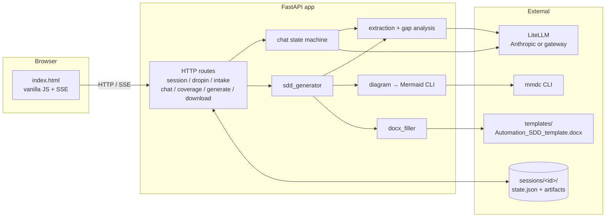

# Automation SDD Builder

Turn business descriptions of a process into a developer-ready spec.

## Features

- **Two input styles:** drop in a transcript / email / paste / file upload, or run a guided chat that asks one focused question at a time.
- **One output:** a `.docx` filled from your template, with the Mermaid applications diagram rendered and embedded inline.
- **Coverage-driven clarification** — after the narrative phase ends, the app scores the conversation against a developer-readiness rubric, consolidates near-duplicate questions, and asks them one at a time. The Generate button unlocks once the coverage threshold is met.
- **Smart answer validation** — each clarification answer is validated by the main model (with a 5-gap lookahead). If the answer is unsatisfactory it asks a more pointed follow-up; after two failed attempts it marks the gap `[TBD]` and moves on.
- **Two-model strategy** — `MODEL_MAIN` (capable) handles all structured generation; `MODEL_CHEAP` (fast) handles the per-turn "is the user done?" classifier and the "is this gap already answered?" check. Configurable per environment.
- **Single-pass extraction** — the full chat transcript is extracted once with `MODEL_MAIN` when the narrative ends, so quality is not diluted by per-turn parsing.
- **Bring your own template** — the `.docx` template is the source of truth. Tokenize once in Word and the filler clones rows for applications / errors / reports, embeds the diagram, and renders the step-by-step flow.
- **Provider-agnostic LLM access** via [LiteLLM](https://docs.litellm.ai). Anthropic API today (with prompt caching enabled for ~90% off the repeated system prompt); any OpenAI-compatible corporate gateway later by editing `.env` — no code changes.


## Architecture



The orchestration is a hand-written state machine: *no agent framework*.

### User flow

```
Intake form → Chat narrative → [MODEL_CHEAP: "done yet?"] →
Clarification questions → [MODEL_MAIN: validates answers] →
Click "Generate" → re-extract + enrich + diagram + fill .docx → download
```

Five phases: `intake → narrative → clarification → ready_to_generate → generated`. Every transition is triggered by a user action.

## Quickstart

**Prerequisites:** Python 3.11+, Node 18+, [`uv`](https://docs.astral.sh/uv/), and `@mermaid-js/mermaid-cli` (`npm install -g @mermaid-js/mermaid-cli`). An LLM API key.

```powershell
# Clone, then from the repo root:
uv venv
.venv\Scripts\activate            # macOS/Linux: source .venv/bin/activate
uv pip install -e ".[dev]"

# Configure LLM access:
Copy-Item .env.example .env       # macOS/Linux: cp .env.example .env
# Edit .env and set ANTHROPIC_API_KEY.

# Run:
uvicorn app.main:app --reload  (or python -m uvicorn app.main:app --reload)
# Visit http://127.0.0.1:8000/
```

If you have `make`, the equivalents are `make install`, `make run`. Other targets: `make format`, `make lint`, `make check`.

## Bringing your own SDD template

`templates/Automation_SDD_template.docx` is the docx the generator fills. It's already tokenized to match the included sample. To use your own template instead:

1. Save your starting docx somewhere outside `templates/` (e.g. the repo root).
2. Open [`prompts/template_tokens.md`](prompts/template_tokens.md) for the full list of `{{tokens}}` and where each one belongs.
3. In Word, paste each token into the matching cell. For the Applications, Errors, and Reports tables, keep one template data row with the `{{prefix.field}}` tokens; delete any extra empty rows (the filler clones the template row once per item).
4. Add a paragraph containing `{{applications_diagram}}` where the diagram should go, and a paragraph containing `{{steps}}` where the step-by-step flow should go.
5. Save the tokenized result to `templates/Automation_SDD_template.docx` (or point `TEMPLATE_PATH` in `.env` somewhere else).

## Using a different LLM backend

The app talks to models through [LiteLLM](https://docs.litellm.ai), so any provider LiteLLM supports works — Anthropic direct, Azure, Bedrock, Ollama, or any OpenAI-compatible corporate gateway. Switch by editing `.env` only.

To route through an internal gateway:

```
OPENAI_API_BASE=
OPENAI_API_KEY=<gateway-token>
MODEL_MAIN=openai/internal-claude-sonnet
MODEL_CHEAP=openai/internal-claude-haiku
```

The model string's prefix (`anthropic/`, `openai/`, `bedrock/`, …) tells LiteLLM how to route. App code only references the semantic roles `MODEL_MAIN` and `MODEL_CHEAP` — see the two-model strategy section below.

### Two-model strategy

| Role | Default | Used for |
|---|---|---|
| `MODEL_MAIN` | Claude Sonnet | Extraction, gap analysis, answer validation (with lookahead), narrative enrichment, diagram generation, gap consolidation |
| `MODEL_CHEAP` | Claude Haiku / GPT-4o Mini | Per-turn "is the user done?" classifier (4-token response); "is this gap already answered?" check |

The cheap model only makes binary yes/no decisions during the chat loop. When the narrative ends, the full transcript is re-extracted with `MODEL_MAIN` before the doc is generated, so the cheap classifier never degrades output quality.

Prompt caching is baked into every `MODEL_MAIN` call (Anthropic `ephemeral` cache control on the system prompt). On Anthropic this gives ~90% off the repeated system-prompt tokens. LiteLLM strips the cache marker transparently for other providers.

## Project structure

```
app/                 FastAPI app + orchestration modules
prompts/             All LLM prompts as .md files — iterate without touching code
templates/           Word template + Jinja templates for the UI
static/              CSS + vanilla JS for the single-page UI
sessions/            generated at runtime; one folder per session, JSON state + artifacts
```

### Python modules

| File | Purpose |
|---|---|
| `app/main.py` | FastAPI routes — the HTTP entry point for all operations |
| `app/chat.py` | Chat state machine + `handle_turn()` streaming; manages the 5 phases and clarification cursor |
| `app/extraction.py` | Raw text → structured `Extracted` Pydantic object via `MODEL_MAIN` |
| `app/gap_analysis.py` | `Extracted` → `Coverage` (rubric-scored, with clarifying questions per gap) |
| `app/sdd_generator.py` | End-to-end SDD pipeline: re-extract, enrich narrative, generate diagram, fill docx |
| `app/diagram.py` | `MODEL_MAIN` generates nodes/edges → Mermaid flowchart syntax → `mmdc` CLI renders to PNG |
| `app/docx_filler.py` | Token replacement in the `.docx` template; clones repeating rows; embeds diagram PNG; renders step-by-step flow |
| `app/llm.py` | Thin LiteLLM wrapper with Anthropic prompt caching; exposes `complete()`, `complete_json()`, `stream()` |
| `app/models.py` | Pydantic schemas: `Session`, `Extracted`, `Coverage`, `ChatMessage`, `Intake`, etc. |
| `app/session.py` | JSON-on-disk session store — create, load, save to `sessions/<id>/state.json` |
| `app/prompts.py` | Loads `.md` prompt files from the `prompts/` directory |
| `app/auth.py` | OAuth2 client-credentials flow for corporate LLM gateways; refreshes bearer token before expiry |

## Design decisions

- **No agent framework.** Orchestration is a deterministic state machine. LLM calls are isolated, single-purpose, and parsed into Pydantic models with a validation-retry loop. Easier to debug than autonomous loops, and the failure modes are obvious.
- **JSON files on disk for sessions, not a database.** The operator can `cat` `sessions/<id>/state.json` to see exactly what the model knows.
- **Single-pass extraction.** The full narrative is collected first, then extracted once when the user signals done. No per-turn extraction to drift or accumulate noise.
- **Prompts live as `.md` files under `prompts/`.** Iterate on prompts without touching code.
- **Vanilla JS, no build step.** Python for the backend, a single static HTML/CSS/JS bundle for the frontend, SSE for streaming. Deployable as one container later.
- **Gap consolidation before clarification.** If 4+ gaps are identified, `MODEL_MAIN` merges near-duplicates into a shorter, non-redundant list before asking the user anything. Falls back to the original list if consolidation fails.

## Built with

[FastAPI](https://fastapi.tiangolo.com/) · [LiteLLM](https://docs.litellm.ai) · [Pydantic](https://docs.pydantic.dev) · [python-docx](https://python-docx.readthedocs.io) · [Mermaid CLI](https://github.com/mermaid-js/mermaid-cli). UI is plain HTML + CSS + vanilla JS with SSE — no framework, no build step.
