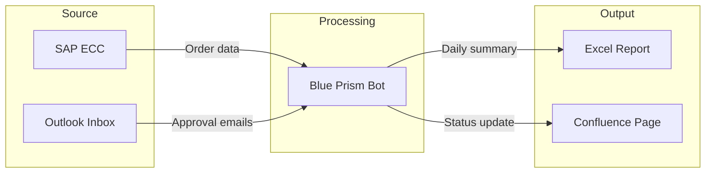

# Automation SDD Builder — Spec

## What this is

A local web app that helps a business analyst (the operator) turn fuzzy business descriptions of a process into one of two outputs:

1. **Technology Fit Report** — given a process, recommend whether and how technology (RPA, Power Automate, SAP BTP, AI, simple scripting, or "don't automate") could improve it. Output is a short markdown report.
2. **SDD (Software Design Document)** — a filled-out Automation Technical Document (`.docx`), ready for handoff to a developer working in Blue Prism, Power Automate, or SAP BTP Build Automation.

Both modes accept two input styles:
- **Drop-in:** the operator pastes / uploads meeting transcripts, emails, existing workflow docs, or screenshots-as-text.
- **Chat:** the operator (or a business user the operator is walking through it) is interviewed by the tool, structured at first and then free-form, with the AI asking clarifying questions to fill gaps.

The end deliverable for SDD mode is a `.docx` matching the operator's existing template, plus an applications/systems diagram embedded in the doc, plus a separate `gaps.md` listing anything the tool wasn't confident about — so the operator can send targeted follow-ups to the business.

## Why this exists

The operator runs an automation team in a regulated environment. Two recurring pain points:

1. **Turning business hand-waving into developer-ready specs.** Developers (Blue Prism mostly) need exact UI steps, decision rules, and exception paths. Business users give high-level descriptions. Bridging that gap is slow manual work.
2. **Deciding what's worth automating.** Not every request is a good RPA candidate. Some belong in Power Automate, some in BTP, some in AI, some shouldn't be automated at all.

This tool compresses both.

## Goals and non-goals

**Goals**
- Ship a working local web app in ~1 day of focused work.
- Produce a real, usable SDD `.docx` from realistic inputs.
- Be obviously useful when demoed on a screenshare with a business user.
- Be deployable later as an internal corporate web app with minimal rework.
- Look credible on a public GitHub repo for someone with an automation-meets-AI background.

**Non-goals (for v1)**
- Multi-user auth, sessions, RBAC, or SSO. The operator is the only user for now.
- Hosting / deployment. Local-only first.
- Generating platform-specific developer artifacts (Blue Prism object definitions, Power Automate JSON, etc.). The tool produces a platform-agnostic SBS flow.
- Audio/video transcription. Assume text input only.
- Approval workflow. Approval happens outside the tool — operator just downloads the doc.
- Production-grade evals. A small handful of test cases is fine.

## Users

- **The operator (primary user, v1):** the business analyst running automation projects. Tech-comfortable, knows what a good SDD looks like, will iterate prompts and rubrics over time.
- **The business user (secondary, v1 via screenshare; primary, v2):** the person who actually understands the process. May not be technical. Should never see scary jargon. Walked through the tool by the operator in v1.

## Architecture overview

```
┌─────────────────────────────────────────────────────────┐
│  Browser (single HTML page, vanilla JS + HTMX)          │
│  - Mode picker (Technology Fit | SDD Builder)           │
│  - Drop-in input panel                                  │
│  - Chat panel                                           │
│  - Coverage indicator + Generate Draft button           │
│  - Output viewer + download links                       │
└────────────────┬────────────────────────────────────────┘
                 │ HTTP / SSE
┌────────────────▼────────────────────────────────────────┐
│  FastAPI app (Python 3.11+)                             │
│  - / (serves the page)                                  │
│  - /api/session (create / get session state)            │
│  - /api/intake (structured Phase 1 answers)             │
│  - /api/chat (Phase 2/3 chat, streaming)                │
│  - /api/coverage (gap analysis pass)                    │
│  - /api/generate (produces docx + diagram + gaps.md)    │
│  - /api/download/{filename}                             │
└────────────────┬────────────────────────────────────────┘
                 │
        ┌────────┴─────────┬────────────────┬─────────────┐
        ▼                  ▼                ▼             ▼
┌──────────────┐   ┌───────────────┐  ┌────────────┐  ┌──────────────┐
│ LLM access   │   │ Session store │  │ Mermaid    │  │ python-docx  │
│ via LiteLLM  │   │ (JSON files   │  │ CLI        │  │ for docx     │
│ (Anthropic   │   │ on disk under │  │ (renders   │  │ template     │
│ now; any     │   │ /sessions/    │  │ diagram    │  │ filling      │
│ OpenAI-      │   │ <session_id>) │  │ to PNG)    │  │              │
│ compatible   │   │               │  │            │  │              │
│ gateway      │   │               │  │            │  │              │
│ later)       │   │               │  │            │  │              │
└──────────────┘   └───────────────┘  └────────────┘  └──────────────┘
```

### Why these choices

- **FastAPI + HTMX + vanilla JS**: one language, one process, no build step. Streaming via SSE is built in. Deployable as a single container later. HTMX gives ~80% of the React feel for chat without the React tax.
- **Sessions as JSON files on disk**: dead simple, debuggable (operator can open the JSON and see the state), no DB to run. `sessions/<uuid>/state.json` plus generated artifacts in the same folder.
- **LiteLLM for model access**: one library, ~100 providers, configured via env. Works with Anthropic API directly for personal use, and with any OpenAI-compatible corporate gateway later by changing config — no code changes. See "LLM access" section below.
- **No agent framework**: the orchestration is deterministic (extract → analyze → ask → generate). Where LLM-driven decisions happen (chat clarifier selection, "is the user done" detection), they're isolated single-purpose LLM calls inside a hand-written state machine. Far simpler to debug than a framework.
- **Mermaid for the diagram**: Claude generates valid Mermaid reliably. Mermaid CLI renders to PNG for embedding. The `.mmd` source ships alongside so the operator or developer can edit it later in any tool.
- **python-docx with placeholder tokens**: the operator's existing `.docx` is the template of truth. Tokens like `{{project_name}}` get find-and-replaced. Updating the template means editing Word, not code.

## LLM access

All LLM calls go through `app/llm.py`, which is a thin wrapper around [LiteLLM](https://docs.litellm.ai). Three functions: `complete()`, `complete_json()` (with Pydantic parsing and retry on validation failure), `stream()` (async, for SSE).

LiteLLM handles provider routing via model-string prefix:
- `anthropic/claude-sonnet-4-6` → uses `ANTHROPIC_API_KEY`, talks to api.anthropic.com
- `openai/some-model` → uses `OPENAI_API_KEY` and optionally `OPENAI_API_BASE` (point this at a corporate gateway)
- `bedrock/...`, `azure/...`, `ollama/...`, etc. — supported, not configured by default

App code references semantic role names from env (`MODEL_MAIN`, `MODEL_CHEAP`), never hardcoded model strings. Swapping a role's model = one env var change.

Default config (v1): personal Anthropic API access.

```
ANTHROPIC_API_KEY=sk-ant-...
MODEL_MAIN=anthropic/claude-sonnet-4-6
MODEL_CHEAP=anthropic/claude-haiku-4-5-20251001
```

Later, for a corporate OpenAI-compatible gateway:

```
OPENAI_API_BASE=https://gateway.yourcompany.internal/v1
OPENAI_API_KEY=<gateway-token>
MODEL_MAIN=openai/internal-claude-sonnet
MODEL_CHEAP=openai/internal-claude-haiku
```

No code changes between the two configurations.

**Note for the operator:** "Anthropic API key" is separate from a Claude.ai Pro/Max subscription. The subscription doesn't grant API access. For programmatic use, get an API key from console.anthropic.com and add a small credit balance — dev costs for this project will be cents to single dollars.

## Chat as a state machine (not an agent)

The chat flow has LLM-driven decisions, but the orchestration is a hand-written state machine — not an agent loop. Phases: `intake → narrative → clarification → ready_to_generate → generated`. Transitions are either user-driven (submit intake, click Generate Draft) or LLM-classified (a Haiku call answering "is the user done describing the process?"). The "next question" in the clarification phase is also an LLM call, with structured input (current Extracted, current Coverage, recent transcript) and structured output (a single question string).

Two LLM-driven decisions, isolated, each a single call with its own prompt file:
- `prompts/is_user_done.md` — classifier, returns yes/no
- `prompts/clarifier_question.md` — picks the next best question given state

Everything else is plain Python control flow. No framework, no agent loop, no tool-calling. This is intentional: the path is known, the steps are bounded, and a state machine is more reliable and far easier to debug than an agent for this shape of problem.

## Modes

### Mode 1: Technology Fit

**Purpose:** given a process, recommend the best technology approach.

**Input options:**
- Paste / upload free-form description (meeting transcript, email, etc.)
- Walk through the chat flow

**Rubric the AI uses to evaluate:**
- Is the process **rule-based** or does it require human judgment?
- Is it **high-volume / repetitive** enough to justify automation effort?
- Are the **inputs structured** (forms, databases) or unstructured (free text, images)?
- Are the **applications involved** automation-friendly (stable UIs, APIs available)?
- Is access to required tools **available** to the team?
- Is there a **clear success criterion** and measurable outcome?
- Would **AI** add value (extraction, classification, drafting)?
- Is the process **stable**, or does it change frequently in ways that would break automation?

**Output: a markdown report with:**
- Process summary (2–3 sentences)
- Recommended approach: RPA (Blue Prism / Power Automate Desktop), workflow automation (Power Automate Cloud), integration platform (SAP BTP), AI-assisted manual process, simple scripting, or "not a good fit — here's why"
- Estimated complexity (simple / medium / high)
- Key risks / blockers
- Suggested next steps
- Open questions for the business

This output is markdown shown in the browser with a "Download as .md" button. No docx for this mode in v1.

### Mode 2: SDD Builder

**Purpose:** produce a developer-ready SDD `.docx` matching the operator's template.

**Phases (chat input mode):**

**Phase 1 — Structured intake.** Wizard-style form, ~6 questions, fast:
- Project name
- Business owner / requester
- Trigger type (scheduled | manual | event-driven | other)
- Frequency / expected volume
- Applications involved (rough list — refined later)
- Business criticality (low | medium | high | critical)

**Phase 2 — Free-form process narrative.** Single open prompt:
> "Walk me through the process from start to finish. Don't worry about perfection — describe it the way you'd explain it to a coworker. I'll ask follow-up questions after."

The AI's job here is to *capture, not interrogate.* It can ask at most one short clarifier per user turn, and only if the user has clearly paused or asked for a prompt. The user signals end-of-narrative either explicitly ("that's it" / "I'm done") or implicitly (silence + the AI's classifier judges they've stopped).

**Phase 3 — Targeted clarification.** AI runs gap analysis against the developer-ready rubric (see below) and asks **one focused question at a time** in conversational tone. Examples of good questions:
- "You said you 'approve the request' — when you do that, what screen are you on and what exactly do you click?"
- "You mentioned checking if the amount is too high. What's the threshold, and where does that rule come from?"
- "If the customer system is down when you try to look up the record, what do you normally do?"

The AI must NOT:
- Ask multiple questions at once
- Use jargon like "exception handling pattern" or "idempotency"
- Re-ask things the user already covered
- Lecture

**Phase 4 — Coverage check + draft generation.** Visible coverage indicator (% based on rubric completion). User clicks **Generate Draft** when ready. Tool produces:
- Filled `.docx` (template find-and-replace)
- Applications diagram embedded as PNG + standalone `.mmd` and `.png` files
- `gaps.md` — bulleted list of remaining unknowns, formatted as questions the operator can paste into an email to the business

**Drop-in input mode for SDD Builder:**
- Operator pastes / uploads source material
- Tool runs the same extraction → gap analysis → coverage check
- Operator can either click Generate Draft immediately (accepting gaps) or switch into chat mode to fill them in interactively

## The developer-ready rubric (gap analysis criteria)

This is the heart of the gap analysis. It should live as `prompts/rubric.md` so the operator can edit it without touching code.

For each step in the process narrative, a developer needs to know:

1. **Trigger** — what kicks this step off? (time, event, completion of prior step, manual)
2. **Application + screen** — which app, which specific screen/page/view
3. **Action** — exact UI action (click which button, select which dropdown value, type into which field) OR API call if available
4. **Data inputs** — what data is needed, where it comes from, what format
5. **Data outputs** — what data is produced, where it goes
6. **Decision logic** — any "if X then Y" — what are X and Y, what's the source of truth for the rule
7. **Exception paths** — what if the system is down, data is missing, action fails, user denies, etc.
8. **Success criterion** — how do you know this step worked

For the process overall:
- **Volume / frequency** — how often, how many per run
- **SLA / timing** — how fast does it need to complete
- **Access / authentication** — service account? SSO? MFA? credential vault?
- **Compliance / audit** — any required logging, screenshots, approvals
- **Reporting** — what does the business need to see about runs (success rate, exceptions, throughput)

The rubric prompt should instruct Claude to score each item per step as `covered | partial | missing` and produce focused questions for `partial` and `missing` items.

## Data flow

```
1. Operator picks mode (Technology Fit | SDD Builder)
2. Operator picks input style (Drop-in | Chat)
3. Session created, session_id returned
4. Input collected:
   - Drop-in: text + optional uploaded files → extracted text → stored in session.raw_input
   - Chat: Phase 1 answers → session.intake; Phase 2/3 turns → session.transcript
5. Extraction pass: Claude reads session input, produces structured JSON (see schema)
   stored in session.extracted
6. Gap analysis pass: Claude scores session.extracted against rubric,
   produces session.coverage + session.questions
7. (Chat only) Loop on Phase 3 until operator clicks Generate Draft
8. Generation pass:
   - Technology Fit: Claude writes markdown report → session.report.md
   - SDD: Claude writes per-section content + diagram Mermaid →
     python-docx fills template → mermaid CLI renders PNG → docx gets PNG embedded
     → gaps.md generated from unresolved rubric items
9. Files presented for download
```

## Session schema

`sessions/<session_id>/state.json`:

```json
{
  "session_id": "uuid",
  "mode": "technology_fit | sdd_builder",
  "input_style": "drop_in | chat",
  "phase": "intake | narrative | clarification | ready_to_generate | generated",
  "intake": {
    "project_name": "...",
    "business_owner": "...",
    "trigger_type": "scheduled | manual | event | other",
    "trigger_detail": "...",
    "frequency": "...",
    "applications_rough": ["..."],
    "criticality": "low | medium | high | critical"
  },
  "raw_input": "...",                // for drop-in mode
  "transcript": [                    // for chat mode
    {"role": "assistant", "content": "...", "ts": "..."},
    {"role": "user", "content": "...", "ts": "..."}
  ],
  "extracted": { /* see Extraction schema */ },
  "coverage": {
    "overall_pct": 0.62,
    "by_category": {"trigger": 1.0, "decision_logic": 0.3, ...},
    "items": [
      {"id": "step_3.decision_logic", "status": "missing",
       "question": "What's the threshold amount..."}
    ]
  },
  "generated_files": ["sdd.docx", "applications_diagram.png",
                      "applications_diagram.mmd", "gaps.md"]
}
```

## Extraction schema (Pydantic models)

This is what Claude is instructed to output during the extraction pass. Living in `app/models.py`:

```python
class Application(BaseModel):
    name: str
    version: Optional[str] = None
    language: Optional[str] = None         # interface language, e.g., English
    environment: Optional[str] = None      # Web | Citrix | Thick client | API | ...
    access_method: Optional[str] = None    # SSO | service account | ...
    notes: Optional[str] = None

class ErrorException(BaseModel):
    name: str
    action: Optional[str] = None
    parameters: Optional[str] = None
    handling: Optional[str] = None

class Step(BaseModel):
    number: int
    summary: str                           # one-line developer-facing summary
    application: Optional[str] = None      # links to Application.name
    screen: Optional[str] = None
    action_detail: Optional[str] = None    # exact UI / API action
    data_inputs: List[str] = []
    data_outputs: List[str] = []
    decision_logic: Optional[str] = None
    exception_paths: List[str] = []
    success_criterion: Optional[str] = None

class ReportRow(BaseModel):
    report_type: str
    update_frequency: Optional[str] = None
    details: Optional[str] = None
    monitoring_tool: Optional[str] = None

class Extracted(BaseModel):
    project_name: str
    business_owner: Optional[str] = None
    summary: str                                  # 2-3 sentence process overview
    automation_tools: List[str] = []              # Blue Prism, Power Automate, ...
    btp_services: List[str] = []
    document_processing: List[str] = []
    new_sdks_objects: List[str] = []
    artificial_intelligence: List[str] = []
    credential_management: Optional[str] = None
    tool_selection_rationale: Optional[str] = None
    business_criticality: Optional[str] = None
    complexity_score: Optional[str] = None        # simple | medium | high
    applications: List[Application] = []
    known_errors: List[ErrorException] = []
    accepted_failure_threshold: Optional[str] = None
    rerun_on_failure: Optional[str] = None
    schedule_frequency: Optional[str] = None
    bot_utilization_pct: Optional[float] = None
    triggers: Optional[str] = None
    reports: List[ReportRow] = []
    steps: List[Step] = []
    applications_diagram_mermaid: Optional[str] = None  # generated separately, stored here
```

Use Pydantic with `model_validate_json` and Claude's structured output / strict-JSON prompting.

## .docx template strategy

Operator takes their existing template and replaces fillable cells with placeholder tokens. Tokens use double-curly syntax: `{{project_name}}`, `{{business_owner}}`, etc. For table rows that repeat (applications, errors, reports, steps), use a row-template approach: include one placeholder row with tokens like `{{app.name}}`, `{{app.version}}`, and have python-docx clone the row for each item.

For the embedded applications diagram, the template should have a placeholder paragraph or bookmark named `applications_diagram_anchor` — python-docx finds it and inserts the PNG inline.

Concrete token list (mirrors Extracted schema) lives in `prompts/template_tokens.md` so the operator and Claude Code stay in sync.

## Prompts

Prompts live in `prompts/` as `.md` files, loaded at runtime. Keeping them out of code makes iteration much faster.

- `prompts/system_chat.md` — system prompt for the chat (tone, one-question-at-a-time rule, never use jargon, etc.)
- `prompts/extract.md` — instructions for the extraction pass + the Extracted JSON schema
- `prompts/gap_analysis.md` — instructions for scoring extracted content against the rubric
- `prompts/rubric.md` — the developer-ready rubric (editable)
- `prompts/diagram.md` — instructions for generating the Mermaid applications diagram
- `prompts/sdd_narrative.md` — instructions for writing narrative sections (summary, tool selection rationale)
- `prompts/technology_fit.md` — instructions for the Technology Fit report
- `prompts/clarifier_question.md` — instructions for asking the next clarifying question given current state
- `prompts/is_user_done.md` — classifier prompt: has the user finished their initial process description? Returns yes/no.

## Diagram generation

Single diagram type for SDD: **applications/systems diagram.** High-level — shows the applications involved in the flow and how data moves between them. Not a step-by-step flowchart.

Mermaid flavor: `flowchart LR` with subgraphs grouping applications by type (e.g., "Source systems," "Processing," "Output"). Edges labeled with what flows between them. Example:



Mermaid CLI invocation: `mmdc -i diagram.mmd -o diagram.png -b transparent -w 1600`.

The SBS flow (step-by-step list) is NOT a diagram — it's a numbered list of steps in the docx, generated from `Extracted.steps`.

## File layout

```
automation-sdd-builder/
├── README.md
├── pyproject.toml                  # uv or poetry
├── .env.example                    # ANTHROPIC_API_KEY
├── .gitignore
├── app/
│   ├── __init__.py
│   ├── main.py                     # FastAPI app + routes
│   ├── models.py                   # Pydantic schemas
│   ├── session.py                  # session JSON read/write
│   ├── llm.py                      # LiteLLM-based complete/complete_json/stream
│   ├── prompts.py                  # prompt file loader
│   ├── extraction.py               # extract from raw input
│   ├── gap_analysis.py             # rubric scoring + question gen
│   ├── chat.py                     # chat state machine, streaming
│   ├── diagram.py                  # Mermaid rendering via subprocess
│   ├── docx_filler.py              # python-docx template filling
│   ├── technology_fit.py           # mode 1 report generation
│   └── sdd_generator.py            # mode 2 orchestration
├── prompts/
│   ├── system_chat.md
│   ├── extract.md
│   ├── gap_analysis.md
│   ├── rubric.md
│   ├── diagram.md
│   ├── sdd_narrative.md
│   ├── technology_fit.md
│   ├── clarifier_question.md
│   └── template_tokens.md
├── templates/
│   ├── Automation_SDD_template.docx     # operator's docx with {{tokens}}
│   └── index.html                       # the single-page UI
├── static/
│   ├── styles.css
│   └── app.js
├── sessions/                       # gitignored, runtime state
│   └── .gitkeep
├── evals/
│   ├── fixtures/
│   │   ├── invoice_process_transcript.md
│   │   ├── expense_approval_email_thread.md
│   │   └── vague_request.md
│   └── test_extraction.py          # 3-5 fixture-based checks
└── scripts/
    └── prepare_template.py         # one-time helper to convert operator's
                                    # docx into a tokenized template
```

## Routes (FastAPI)

| Method | Path | Purpose |
|---|---|---|
| GET | `/` | Serve index.html |
| POST | `/api/session` | Create new session, return session_id |
| GET | `/api/session/{id}` | Get current session state |
| POST | `/api/intake` | Submit Phase 1 structured answers |
| POST | `/api/dropin` | Submit drop-in raw text + files |
| POST | `/api/chat/{id}` | Send a chat turn, stream response (SSE) |
| POST | `/api/coverage/{id}` | Trigger gap analysis pass, return coverage |
| POST | `/api/generate/{id}` | Run generation, return list of artifact filenames |
| GET | `/api/download/{id}/{filename}` | Download generated artifact |

## UI sketch

Single page, three-pane layout:

```
┌────────────────────────────────────────────────────────────────┐
│  Automation SDD Builder        [Technology Fit] [SDD Builder]  │
├────────────────────────────────────────────────────────────────┤
│  Input (left)            │  Chat / Status (center)             │
│  ────────────────         │  ──────────────────────              │
│  [Drop-in] [Chat]         │  (chat transcript or status log)    │
│  Drop-in panel:           │                                     │
│   - paste textarea        │                                     │
│   - file upload           │                                     │
│   - "Process" button      │                                     │
│  Chat panel:              │                                     │
│   - intake form (Phase 1) │                                     │
│   - chat input (Phase 2+) │                                     │
├────────────────────────────────────────────────────────────────┤
│  Coverage: ████████░░ 78%  Missing: decision logic, exceptions │
│  [Generate Draft]                                              │
├────────────────────────────────────────────────────────────────┤
│  Output (when ready):                                          │
│   📄 sdd.docx  🖼 applications_diagram.png  📝 gaps.md         │
└────────────────────────────────────────────────────────────────┘
```

HTMX handles partial swaps for chat turns and coverage updates. SSE for streaming chat tokens.

## Configuration

`.env`:
```
# Personal use (v1):
ANTHROPIC_API_KEY=sk-ant-...
MODEL_MAIN=anthropic/claude-sonnet-4-6
MODEL_CHEAP=anthropic/claude-haiku-4-5-20251001

# Other config:
SESSIONS_DIR=./sessions
TEMPLATE_PATH=./templates/Automation_SDD_template.docx
MERMAID_CLI=mmdc

# Later, for a corporate gateway (uncomment and swap):
# OPENAI_API_BASE=https://gateway.yourcompany.internal/v1
# OPENAI_API_KEY=<gateway-token>
# MODEL_MAIN=openai/internal-claude-sonnet
# MODEL_CHEAP=openai/internal-claude-haiku
```

Model strings always include a provider prefix (`anthropic/...`, `openai/...`, etc.). LiteLLM uses the prefix to route. Code references semantic roles only (`MODEL_MAIN`, `MODEL_CHEAP`).

## Dependencies

- `fastapi`, `uvicorn[standard]`, `python-multipart` (for file uploads)
- `litellm` (LLM access — works with Anthropic now, OpenAI-compatible gateways later)
- `pydantic` (v2)
- `python-docx`
- `jinja2` (template rendering for index.html)
- `python-dotenv`
- Node + `@mermaid-js/mermaid-cli` installed globally (assume present, fail fast if missing)
- Optional: `htmx.org` via CDN in the HTML, no npm needed

## Testing strategy

`evals/` directory with 3 fixtures (varying quality of input) and tests that:
1. Run extraction on each fixture, assert the resulting Extracted has expected required fields populated
2. Run gap analysis, assert coverage is roughly in expected range (low for vague fixture, high for detailed fixture)
3. Snapshot test: generate SDD docx from a fixture, assert the file exists and key tokens were replaced

Tests use real Claude API calls (small cost, run them sparingly). Mark as `@pytest.mark.live` so they don't run in default `pytest`. Document in README how to run them.

## What good looks like at end of day 1

- Operator can pick SDD Builder + Chat mode
- Fill out intake form
- Have a 5-minute chat about a real process
- See a coverage indicator update as they go
- Click Generate Draft
- Download a real filled `.docx`, a real PNG diagram, and a real `gaps.md`
- The `.docx` is good enough to send to a Blue Prism developer with minor edits

Mode 1 (Technology Fit) and drop-in input style also work end-to-end, but with rougher edges.

## What v2 should add (note in README, don't build)

- Web deployment + corporate SSO (Azure AD / Okta)
- Multi-user sessions, sharable session links for business users
- Approval workflow (draft → review → approved)
- Real DB instead of JSON files
- Audio/video transcription input
- Refinement of generated docx via additional chat ("change step 3 to...")
- Better evals + a small benchmark suite
- Platform-specific output adapters (Blue Prism object skeletons, Power Automate flow JSON)
